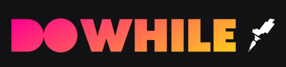
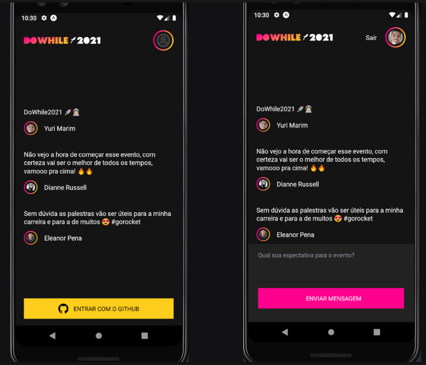

<p align="center">
   
</p>

<p align="center">
  
  
  
  <p align="center">
  <a href="#sobre">Sobre</a>&nbsp;&nbsp;&nbsp;|&nbsp;&nbsp;&nbsp;
  <a href="#tecnologias-utilizadas">Tecnologias utilizadas</a>&nbsp;&nbsp;&nbsp;|&nbsp;&nbsp;&nbsp;
  <a href="#licença-e-autor">Licença e Autor</a>
</p>

## Sobre

**DoWhile2021 -> Front-end App (React Native).** trata-se de um projeto realizado durante um evento da Rocketseat - Next Level Week Heat: Trilha Impulse 🚀🔥

## Projeto

<p align="center">
   
</p>

## Rodar projeto

- Na pasta do projeto rodar:

```
expo
```

- Para iniciar o servidor:

```
expo start
```

### Tecnologias utilizadas

- React Native
- Expo
- Typescript
- React Native SVG
- SVG Transformer
- React native X Helper
- Moti
- React Native Reanimated
- CSS
- Axios
- Autenticação GitHub

## Licença e Autor

Este projeto está sob a licença MIT. Veja o arquivo [LICENSE](https://github.com/yurimarim/nlw-heat-impulse-app/blob/main/LICENSE.txt) para mais detalhes.

<p>


[](https://www.linkedin.com/in/yurimarim)
